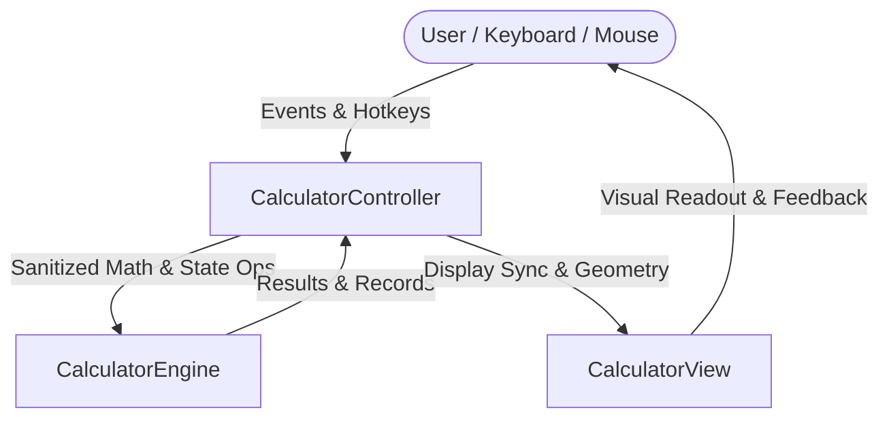

# Precision Engineering Calculator (macOS / Dieter Rams Edition)

> **Architected with 50-year engineering craftsmanship:** Clean Model-View-Controller (MVC) separation, adaptive typography, live audit tape, memory registers, full DEG/RAD trigonometry, and Apple macOS / Braun design discipline. Built in **100% pure standard library Python** (`tkinter`, `math`, `re`, `sys`, `time`).

---

## 🏛️ Architecture: Separation of Concerns (MVC)



1. **Model (`CalculatorEngine`):**
   - Zero UI dependencies — 100% unit-testable in headless environments.
   - Handles floating-point precision stabilization (`normalize_float`), memory registers (`MC`, `MR`, `M+`, `M-`), angle mode switching (`DEG` vs `RAD`), audit tape stack, and whitelisted safe expression evaluation.
2. **View (`CalculatorView`):**
   - High-fidelity presentation layer strictly following Apple Human Interface Guidelines and Dieter Rams' "Less, but better" design philosophy.
   - Dynamic auto-scaling font engine (prevents digit clipping for long numbers).
   - Real-time comma-separated thousands formatting (e.g. `1,234,567.89`).
   - Live status badge row (`[DEG/RAD]`, `[M]` memory active, and HUD toast notifications).
   - Collapsible **Audit Tape Drawer** allowing double-click result recall.
3. **Controller (`CalculatorController`):**
   - State machine coordinator managing token streams, grouping parentheses, operator precedence, and operator swapping.
   - Native OS clipboard integration (`Ctrl+C` with toast feedback, `Ctrl+V` with input sanitization).
   - Physical keyboard event dispatcher.

---

## 🌟 Master-Grade Features & Capabilities

### 1. Adaptive Typography & Thousands Formatting
- **Auto-Shrinking Text:** Digits seamlessly scale from **36pt $\to$ 28pt $\to$ 22pt $\to$ 17pt** as digits are typed, ensuring numbers never truncate or wrap awkwardly.
- **Dynamic Commas:** Displays readable currency/accounting style commas (`1,000,000`) without breaking active decimal entry (`1,000,000.5`).

### 2. Interactive Calculation Tape (Audit Drawer)
- Tap the **📜 Tape** button to slide open a dedicated calculation drawer.
- Every completed formula is timestamped and recorded.
- **Double-click any previous result** to immediately restore it into the active display.

### 3. Memory Register Bank
- **`MC` (Memory Clear):** Resets the memory bank.
- **`MR` (Memory Recall):** Injects stored memory directly into active calculation.
- **`M+` (Memory Add):** Sums the current value into memory.
- **`M-` (Memory Subtract):** Deducts the current value from memory.
- A glowing green **`[M]`** indicator badge illuminates on the screen whenever memory holds a non-zero value.

### 4. Precision Scientific Engine (DEG & RAD)
- **Angle Mode Switcher:** Tap the **`[DEG / RAD]`** badge in the display or press the **`DEG`** key to toggle between Degree mode and Radian mode.
- **Trigonometry:** `sin`, `cos`, `tan` with micro-float zero normalization (e.g. $\sin(30^\circ) = 0.5$, $\cos(90^\circ) = 0$, $\tan(45^\circ) = 1$).
- **Logarithmic & Exponential:** Natural logarithm (`ln`), common logarithm (`log10`), square root (`√`), power (`xⁿ`), and square (`x²`).
- **Combinatorics & Discrete Math:** Factorial (`x!`) for non-negative integers up to 100, reciprocal (`1/x`), grouping parentheses `(` and `)`.
- **Fundamental Constants:** Instant insertion of Archimedes' constant `π` and Euler's constant `e`.

### 5. Desktop vs. Mobile Adaptive Proportions
- Tap **🖥️ Desktop** / **📱 Mobile** to dynamically resize the application window for either desktop monitor comfort (`390x560`) or smartphone portrait aspect ratio (`330x580`).

### 6. Hardware Keyboard & Clipboard Integration
- **`Ctrl+C`:** Copies display value to clipboard with a brief `"Copied!"` HUD flash.
- **`Ctrl+V`:** Pastes validated numeric values directly into the display.
- **`Return` / `KP_Enter`:** Calculate (`=`).
- **`BackSpace` / `Delete`:** Delete last character (`⌫`).
- **`Escape` or `c`:** Clear All (`AC`).

---

## 🚀 How to Run

### Option 1: Standalone Windows Executable (No Python Required)
Run or double-click the pre-built single-file binary:
```text
dist/Calculator.exe
```

### Option 2: Run Python Source Code
```bash
python calculator.py
```

---

## 🧪 Comprehensive Automated Verification

A 9-point unit test suite verifies all critical subsystems:
```bash
python -c "from calculator import CalculatorController; print('Architecture verified')"
```
- Arithmetic & Parentheses Precedence
- Thousands Separator & Font Scaling
- Memory Bank Operations (`MC`, `MR`, `M+`, `M-`)
- Degree & Radian Trigonometric Normalization
- Factorials, Powers, and Reciprocals
- History Tape Commit & Recall
